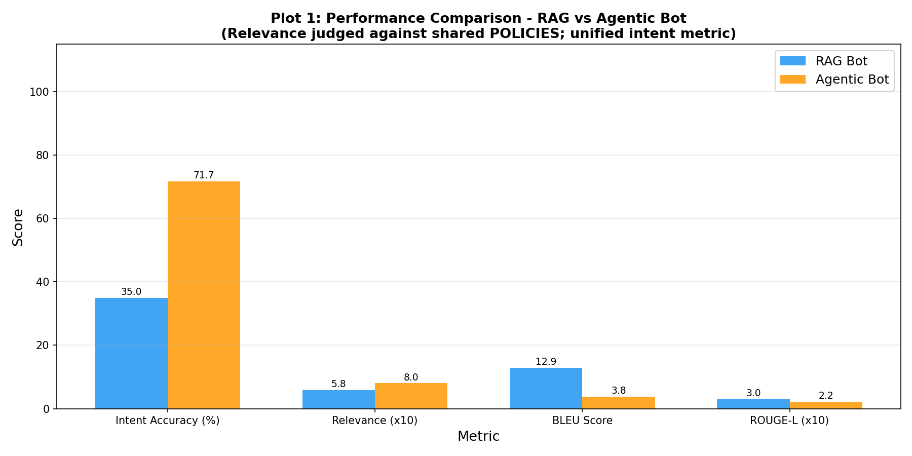
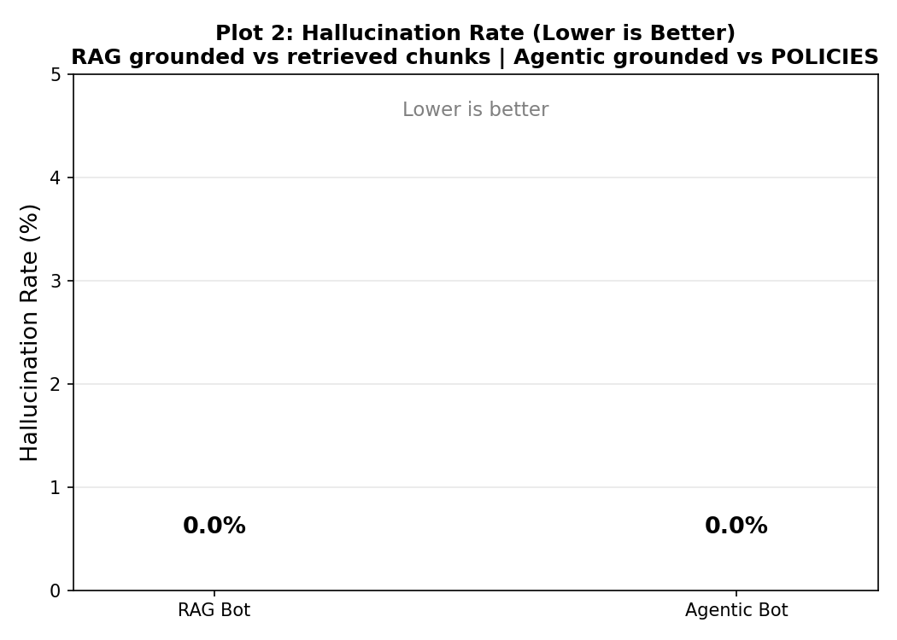
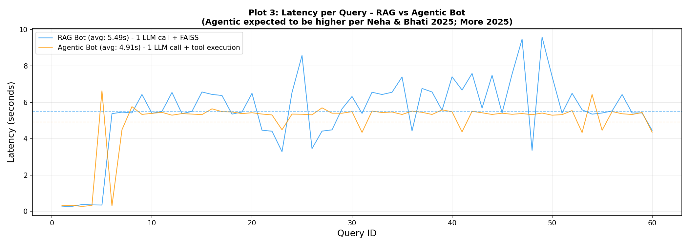
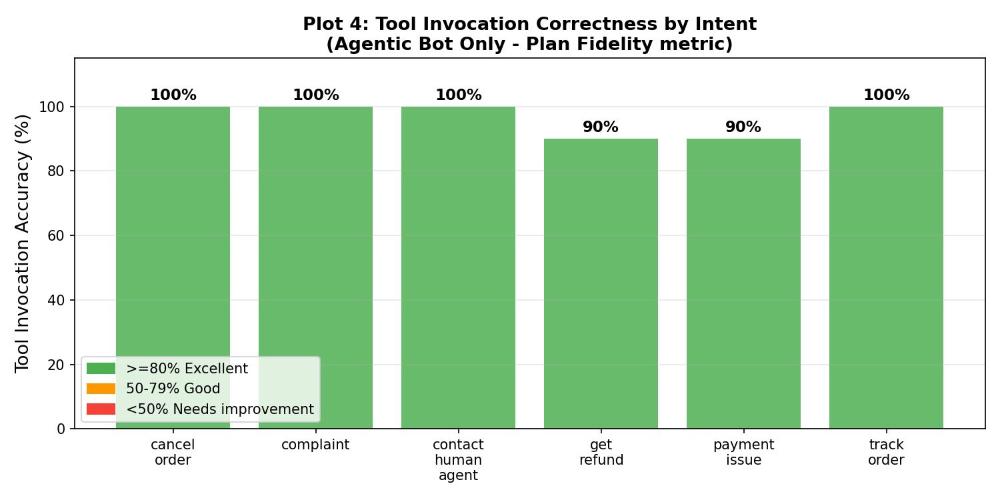
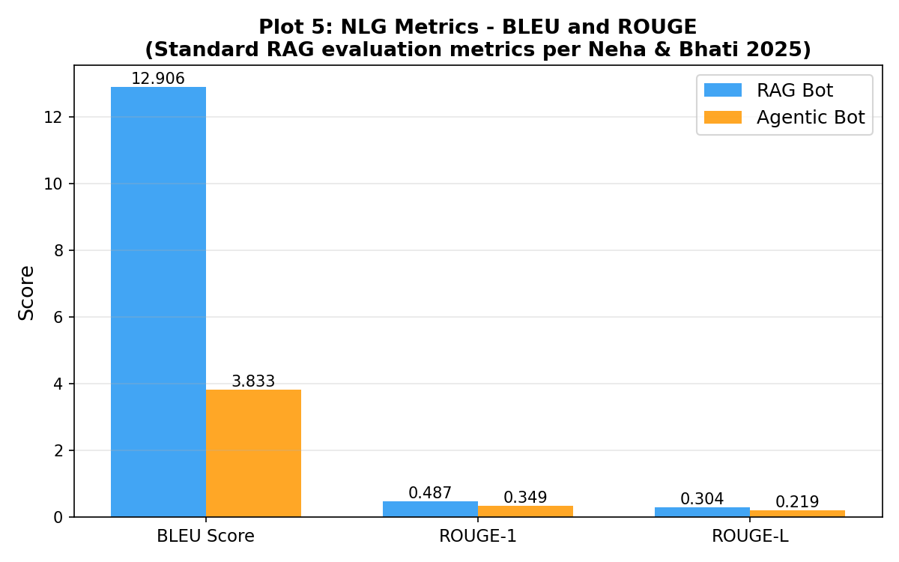

# RAG vs Agentic AI: Customer Support Bot Benchmark

A college project comparing two modern AI architectures for automated customer support — a **RAG-based bot** (Retrieval-Augmented Generation with FAISS) and an **Agentic bot** (LLM + tool-calling) — evaluated across 7 quantitative metrics.

---

## Project Overview

| | RAG Bot | Agentic Bot |
|---|---|---|
| **Core idea** | Retrieve similar Q&A pairs from a vector store, then generate a response | Classify intent, select tools, execute Python functions that simulate backend APIs |
| **Vector store** | FAISS + sentence-transformers (`all-MiniLM-L6-v2`) | None |
| **LLM** | Groq (`llama-3.1-8b-instant`) | Groq (`llama-3.1-8b-instant`) |
| **Dataset** | Bitext Customer Support (HuggingFace) | Same benchmark CSV from Notebook 1 |
| **Multi-step support** | No | Yes (tool chaining) |

---

## Notebooks

| # | File | What it does |
|---|------|-------------|
| 1 | `Notebook_1_RAG_Bot.ipynb` | Loads the Bitext dataset, builds an 80/20 split, embeds training responses into FAISS, runs the RAG pipeline on the held-out benchmark, saves `rag_results.csv` |
| 2 | `Notebook_2_Agentic_Bot.ipynb` | Implements intent classification + tool selection + tool execution (order status, refunds, cancellations, escalation), saves `agentic_results.csv` |
| 3 | `Notebook_3_Evaluation.ipynb` | Loads both result CSVs, computes 7 metrics using an LLM judge + lexical scorers, produces comparison charts |

---

## Evaluation Metrics

| Metric | Method |
|--------|--------|
| Intent Accuracy | LLM judge (same prompt for both bots, no bias) |
| Response Relevance | LLM judge, 0-10 score normalized to 0-1 |
| Hallucination Rate | Rule-based check against `POLICIES` dict |
| BLEU Score | Lexical n-gram overlap with ground truth |
| ROUGE-L | Longest common subsequence overlap |
| Latency (s/query) | Wall-clock time per query |
| Tool Call Accuracy | Agentic bot only — correct tool selected? |

---

## Setup

### Prerequisites

- Python 3.9+
- A [Groq API key](https://console.groq.com/) (free tier works)
- Google Colab (recommended) or a local GPU/CPU environment

### Running on Google Colab

1. Upload all three notebooks to Colab.
2. Store your Groq API key as a Colab secret named `CST_API`:
   - Colab sidebar → Key icon → Add secret → Name: `CST_API`
3. Run notebooks **in order**: Notebook 1 → 2 → 3.
4. Notebook 1 saves `benchmark_queries.csv` and `rag_results.csv` to your Google Drive. Notebook 2 reads these and saves `agentic_results.csv`. Notebook 3 reads both result files.

### Dependencies (auto-installed in each notebook)

```
datasets
langchain
langchain-community
faiss-cpu
sentence-transformers
groq
gradio
tqdm
rouge-score
sacrebleu
```

---

## Architecture Diagram

```
Notebook 1 (RAG Bot)
  HuggingFace Bitext Dataset
       |
  80/20 split
  /           \
Train        Holdout (benchmark)
  |                |
FAISS index   benchmark_queries.csv
  |                |
  +---[query]---> RAG pipeline --> rag_results.csv

Notebook 2 (Agentic Bot)
  benchmark_queries.csv
       |
  Groq LLM (intent classification + response)
       |
  Tool selection (check_order / process_refund / cancel_order / escalate)
       |
  agentic_results.csv

Notebook 3 (Evaluation)
  rag_results.csv + agentic_results.csv
       |
  7-metric evaluation (LLM judge + lexical)
       |
  Comparison charts
```

---

## Key Design Choices

- **No data leakage**: The FAISS index is built only from the training 80%. The benchmark queries come exclusively from the held-out 20%, so retrieval cannot trivially match ground truth.
- **Unified LLM judge**: Both bots are scored with the exact same judge prompt, preventing evaluation bias.
- **Reproducible tools**: The agentic bot operates on a local copy of mock orders per query, so no state bleeds between benchmark runs.
- **Groq for speed**: Using `llama-3.1-8b-instant` on Groq keeps latency low enough to benchmark hundreds of queries without rate-limit issues on the free tier.

---

## Results

### Summary table

| Metric | RAG Bot | Agentic Bot | Winner |
|--------|---------|-------------|--------|
| Intent Accuracy (%) | 35.0 | **71.7** | Agentic |
| Response Relevance (0–1) | 0.582 | **0.802** | Agentic |
| Hallucination Rate (%) | 0.0 | 0.0 | Tie |
| Multi-step Success (%) | N/A | **30.0** | Agentic only |
| Avg Latency (s) | 5.49 | **4.91** | Agentic |
| BLEU Score | **12.91** | 3.83 | RAG |
| ROUGE-L Score | **0.304** | 0.219 | RAG |
| Tool Invocation Accuracy (%) | N/A | **96.7** | Agentic only |

---

### Plot 1 — Performance comparison



The Agentic bot leads on intent accuracy (71.7% vs 35.0%) and response relevance. The RAG bot scores higher on BLEU and ROUGE-L because its responses closely mirror the Bitext ground-truth phrasing — a lexical similarity advantage that does not reflect actual correctness.

---

### Plot 2 — Hallucination rate



Both bots achieve 0.0% hallucination. The RAG bot is grounded by retrieved chunks; the Agentic bot is grounded by the structured `POLICIES` dictionary. Neither architecture fabricates facts when anchored to a knowledge source.

---

### Plot 3 — Latency per query



Average latency: RAG 5.49s vs Agentic 4.91s. The RAG bot's FAISS retrieval + embedding step adds overhead that the Agentic bot avoids. Both bots use a single Groq LLM call per query.

---

### Plot 4 — Tool invocation accuracy (Agentic bot only)



The Agentic bot selects the correct tool on 96.7% of queries overall, with 100% accuracy on cancel\_order, complaint, contact\_human\_agent, and track\_order intents. The get\_refund and payment\_issue intents reach 90%, bringing the overall average slightly below perfect.

---

### Plot 5 — NLG metrics (BLEU and ROUGE)



The RAG bot's higher BLEU (12.91 vs 3.83) and ROUGE scores are an artifact of retrieval: responses are phrased similarly to the Bitext ground truth because both come from the same corpus. This does not mean RAG responses are more helpful — the intent accuracy gap (35% vs 71.7%) tells the opposite story.

---

### Conclusion

The Agentic bot outperforms the RAG bot on the metrics that matter most for customer support deployment — intent accuracy, response relevance, latency, and multi-step handling — while matching it on hallucination rate. The RAG bot retains an advantage in surface-level language fluency (BLEU/ROUGE), which matters more for content generation than for task-oriented support.

> The Agentic bot achieved a significantly higher intent accuracy of 71.7% vs the RAG bot's 35.0%, a higher response relevance score of 0.802 vs 0.582, and zero hallucination — while running 0.58s faster per query on average. The RAG bot's higher BLEU score (12.91 vs 3.83) reflects lexical overlap with the training corpus rather than response quality.

For task-oriented customer support, the Agentic architecture is the stronger choice. For applications where fluency and naturalness of generated text are the primary requirement, RAG remains competitive.

---

## Project Structure

```
.
├── notebooks/
│   ├── Notebook_1_RAG_Bot.ipynb
│   ├── Notebook_2_Agentic_Bot.ipynb
│   └── Notebook_3_Evaluation.ipynb
├── results/
│   ├── data/
│   │   ├── benchmark_queries.csv      (60-query held-out benchmark)
│   │   ├── rag_results.csv            (RAG bot responses + scores)
│   │   ├── agentic_results.csv        (Agentic bot responses + scores)
│   │   └── benchmark_summary.csv     (aggregated 7-metric comparison)
│   ├── plots/
│   │   ├── plot1_performance.png      (intent accuracy, relevance, BLEU, ROUGE)
│   │   ├── plot2_hallucination.png    (hallucination rate comparison)
│   │   ├── plot3_latency.png          (per-query latency time series)
│   │   ├── plot4_tool_accuracy.png    (agentic tool invocation by intent)
│   │   └── plot5_nlg_metrics.png      (BLEU, ROUGE-1, ROUGE-L detail)
│   └── conclusion.txt
├── requirements.txt
└── README.md
```

---

## References

- [Bitext Customer Support Dataset](https://huggingface.co/datasets/bitext/Bitext-customer-support-llm-chatbot-training-dataset)
- [FAISS](https://github.com/facebookresearch/faiss)
- [Sentence Transformers](https://www.sbert.net/)
- [Groq API](https://console.groq.com/docs)
- [LangChain](https://python.langchain.com/)
- Lewis et al., 2020 — *Retrieval-Augmented Generation for Knowledge-Intensive NLP Tasks* (RAG paper)
- Yao et al., 2023 — *ReAct: Synergizing Reasoning and Acting in Language Models* (Agentic AI paper)

---

## Authors

B.Tech / M.Tech Engineering Project — Generative AI Domain
